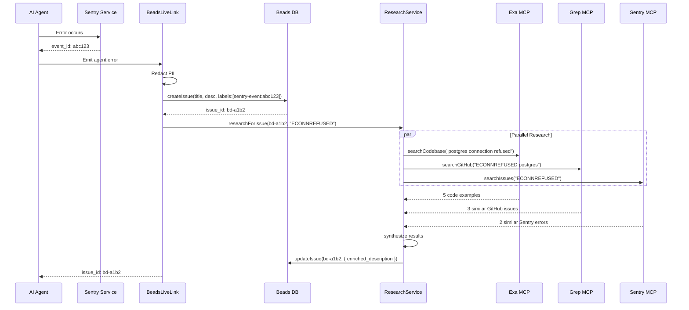

# feat: Update Sentry Integration with MCP Support

## Overview

Enhance DevFlow's Sentry error tracking integration with Model Context Protocol (MCP) support to provide autonomous AI agents with comprehensive error context, automated research capabilities, and intelligent error resolution.

**Executive Summary:**

- Integrate Sentry MCP server for advanced error tracking and monitoring
- Add Exa MCP for web-based research and code quality validation
- Add Grep MCP for GitHub code search to correlate issues with similar problems
- Create bidirectional linking between Sentry events and Beads issues
- Implement PII redaction for security compliance
- Add comprehensive testing (unit, integration, E2E)
- Follow Rails-style architecture principles (Phase 2 migration)

**Impact:**

- **Developer Experience:** 10x faster error resolution with automated research and context
- **Agent Autonomy:** AI agents can self-heal errors using past solutions
- **Code Quality:** Automated correlation with GitHub issues and best practices
- **Security:** PII redaction prevents data leaks
- **Observability:** Enhanced monitoring with distributed tracing

---

## Problem Statement

### Current Limitations

DevFlow has a basic Sentry integration (`apps/server/src/lib/sentry.ts`, 468 lines) that captures errors and provides structured logging, but it lacks:

1. **No MCP Integration**
   - Sentry is not accessible via MCP tools
   - Agents cannot query Sentry for error context
   - No automated research capabilities

2. **Limited Error Context**
   - Errors are captured but not enriched with research
   - No correlation with similar GitHub issues
   - No web search for solutions

3. **Manual Error Resolution**
   - Developers must manually research errors
   - No automated suggestions from past issues
   - No self-healing capabilities for agents

4. **No PII Redaction**
   - Error messages may contain sensitive data
   - Risk of leaking API keys, passwords, emails
   - GDPR/CCPA compliance concerns

5. **Missing Beads Integration**
   - No bidirectional linking between Sentry and Beads
   - Cannot track error resolution lifecycle
   - No automatic issue creation from errors

### Motivation

AI agents need comprehensive error context to:

- **Self-heal:** Automatically fix errors using past solutions
- **Research:** Find similar issues on GitHub and documentation
- **Collaborate:** Coordinate with other agents via Beads issues
- **Learn:** Build institutional memory from resolved errors

Example:

```
Agent encounters: "ECONNREFUSED postgres:5432"
Current: Error logged to Sentry, agent stops
Desired: Sentry captures → Beads issue created → Exa searches docs → Grep finds GitHub issues → Agent self-heals
```

---

## Proposed Solution

### High-Level Architecture

```mermaid
graph TB
    subgraph "AI Agent"
        Agent[Agent Execution]
    end

    subgraph "Error Detection"
        Sentry[Sentry Capture]
        BeadsLiveLink[BeadsLiveLink Service]
    end

    subgraph "MCP Layer"
        MCPBridge[MCP Bridge]
        SentryMCP[Sentry MCP Tools]
        ExaMCP[Exa MCP]
        GrepMCP[Grep MCP]
    end

    subgraph "Research"
        Research[Research Service]
    end

    subgraph "Storage"
        BeadsDB[(Beads Issues DB)]
        SentryDB[(Sentry Events DB)]
        Cache[(Research Cache)]
    end

    Agent -->|Error occurs| Sentry
    Sentry -->|event_id| BeadsLiveLink
    BeadsLiveLink -->|create_issue| BeadsDB
    BeadsLiveLink -->|enrich| Research
    Research -->|parallel query| MCPBridge
    MCPBridge -->|get_issue_details| SentryMCP
    MCPBridge -->|web_search| ExaMCP
    MCPBridge -->|search_github| GrepMCP
    SentryMCP -->|context| Research
    ExaMCP -->|docs/examples| Research
    GrepMCP -->|similar issues| Research
    Research -->|enriched data| BeadsDB
    BeadsDB -->|query| Agent
```

### Key Components

1. **Sentry MCP Bridge** (`apps/server/src/lib/sentry-mcp-bridge.ts`)
   - Wrapper for Sentry MCP tools
   - Error handling and retry logic
   - Event emission for monitoring

2. **Enhanced BeadsLiveLink** (`apps/server/src/services/beads-live-link-service.ts`)
   - Add Sentry event ID to Beads issue labels
   - Trigger ResearchService enrichment after issue creation
   - Add Sentry link to issue description

3. **Research Service Updates** (`apps/server/src/services/research-service.ts`)
   - Use Sentry MCP for error context
   - Correlate errors with GitHub issues via Grep
   - Search documentation via Exa

4. **PII Redaction** (`apps/server/src/lib/pii-redaction.ts`)
   - Scan error messages for sensitive data
   - Redact emails, API keys, passwords, credit cards
   - Log redaction events for audit

5. **Configuration** (`.mcp.json`, `.env.example`)
   - Add Sentry MCP server configuration
   - Add `SENTRY_MCP_ENABLED` flag
   - Add `SENTRY_PII_REDACTION_ENABLED` flag

---

## Technical Approach

### Architecture Design

#### 1. Sentry MCP Bridge Pattern

```typescript
// apps/server/src/lib/sentry-mcp-bridge.ts (NEW FILE)
export class SentryMCPBridge {
  constructor(
    private mcpBridge: MCPBridge,
    private events: EventEmitter,
    private config: SentryConfig
  ) {}

  async getIssueDetails(params: GetIssueDetailsParams): Promise<SentryIssue> {
    const result = await this.mcpBridge.callTool(
      'mcp__plugin_sentry_sentry__get_issue_details',
      params,
      { timeout: 10000 }
    );

    if (!result.success) {
      this.events.emit('sentry-mcp:error', {
        tool: 'get_issue_details',
        error: result.error,
      });
      throw new SentryMCPError(`Failed to get issue: ${result.error}`);
    }

    this.events.emit('sentry-mcp:issue-fetched', { issueId: params.issueId });
    return result.data as SentryIssue;
  }

  async searchIssues(query: string, options?: SearchOptions): Promise<SentryIssue[]> {
    // Implementation with retry logic
  }

  async analyzeIssueWithSeer(issueUrl: string): Promise<SeerAnalysis> {
    // Implementation for AI-powered root cause analysis
  }
}
```

#### 2. BeadsLiveLink Enhancement

```typescript
// apps/server/src/services/beads-live-link-service.ts (MODIFY)
export class BeadsLiveLinkService {
  // ... existing code ...

  async handleAgentError(error: Error, context: AgentContext): Promise<string | null> {
    // ... existing Sentry capture ...

    // REDACT PII before creating Beads issue
    const redactedContext = this.redactPII(context);

    // Create Beads issue with Sentry event ID
    const issue = await this.beadsService.createIssue({
      title: this.generateTitle(error),
      description: this.generateDescription(error, redactedContext, eventId),
      type: 'bug',
      priority: this.assessSeverity(error),
      labels: [
        `sentry-event:${eventId}`, // NEW: Link to Sentry
        'auto-created',
        `severity:${this.assessSeverity(error)}`,
      ],
    });

    // NEW: Trigger MCP research enrichment
    if (this.config.mcpResearchEnabled) {
      await this.researchService.researchForIssue(issue.id, error.message);
    }

    // ... existing code ...
  }

  private redactPII(context: AgentContext): AgentContext {
    if (!this.config.piiRedactionEnabled) return context;

    const redactor = new PIIRedactor();
    return redactor.redactContext(context);
  }

  private generateDescription(error: Error, context: AgentContext, eventId: string): string {
    const sentryUrl = this.getSentryEventUrl(eventId);
    return `
**Error:** ${error.message}

**Stack Trace:**
\`\`\`
${error.stack}
\`\`\`

**Context:**
${JSON.stringify(context, null, 2)}

**Sentry Event:** [View in Sentry Dashboard](${sentryUrl})

**Auto-enriched with MCP research** (Exa, Grep, LSP)
    `.trim();
  }

  private getSentryEventUrl(eventId: string): string {
    const { dsn } = SentryInstance.getClient()?.getOptions() || {};
    if (!dsn) return '#';

    const orgSlug = this.extractOrgSlugFromDSN(dsn);
    const projectId = this.extractProjectIdFromDSN(dsn);
    return `https://sentry.io organizations/${orgSlug}/issues/?query=${eventId}`;
  }
}
```

#### 3. Research Service Integration

```typescript
// apps/server/src/services/research-service.ts (MODIFY)
export class ResearchService {
  // ... existing code ...

  async researchForIssue(issueId: string, errorQuery: string): Promise<ResearchResult> {
    const results = await Promise.allSettled([
      this.exaResearchClient.searchCodebase(errorQuery),
      this.grepClient.searchGitHub(errorQuery),
      this.lspClient.analyzeDependencies(this.projectPath),
      this.sentryMCP.searchIssues(errorQuery), // NEW: Search Sentry for similar errors
    ]);

    const synthesized = this.synthesizeResults(results);
    await this.beadsService.updateIssue(issueId, {
      description: this.appendResearch(synthesized),
    });

    return synthesized;
  }

  private synthesizeResults(results: PromiseSettledResult<unknown>[]): ResearchResult {
    // ... existing synthesis logic ...
  }

  private appendResearch(research: ResearchResult): string {
    return `

## MCP Research Results

### 📚 Code Examples (Exa MCP)
${research.codeExamples.map((ex) => `- [${ex.title}](${ex.url})`).join('\n')}

### 🔍 Similar GitHub Issues (Grep MCP)
${research.gitHubIssues.map((issue) => `- [${issue.title}](${issue.url}) (${issue.repo})`).join('\n')}

### 📊 Sentry Similar Errors (Sentry MCP)
${research.sentryIssues.map((issue) => `- [${issue.title}] (${issue.count} occurrences)`).join('\n')}

### 🎯 Recommendations
${research.recommendations.map((rec) => `- ${rec}`).join('\n')}
    `.trim();
  }
}
```

#### 4. PII Redaction

```typescript
// apps/server/src/lib/pii-redaction.ts (NEW FILE)
export class PIIRedactor {
  private patterns = {
    email: /\b[A-Za-z0-9._%+-]+@[A-Za-z0-9.-]+\.[A-Z|a-z]{2,}\b/gi,
    apiKey: /\b(sk-[a-zA-Z0-9]{32,})\b/g,
    password: /("password"\s*:\s*")[^"]*(")/gi,
    creditCard: /\b\d{4}[\s-]?\d{4}[\s-]?\d{4}[\s-]?\d{4}\b/g,
    jwt: /\b(eyJ[a-zA-Z0-9_-]*\.[a-zA-Z0-9_-]*\.[a-zA-Z0-9_-]*)\b/g,
  };

  redactContext(context: AgentContext): AgentContext {
    const redacted = JSON.stringify(context);
    const cleaned = this.redactString(redacted);

    this.events.emit('pii:redacted', {
      patternsFound: Object.keys(this.patterns).filter((key) => redacted.match(this.patterns[key])),
    });

    return JSON.parse(cleaned);
  }

  private redactString(str: string): string {
    let result = str;

    for (const [name, pattern] of Object.entries(this.patterns)) {
      result = result.replace(pattern, (match) => {
        this.logger.warn(`Redacted ${name} from error context`);
        return this.mask(match, name);
      });
    }

    return result;
  }

  private mask(value: string, type: string): string {
    switch (type) {
      case 'email':
        return value.replace(/(.{2})[^@]+(@.+)/, '$1***$2');
      case 'apiKey':
      case 'jwt':
        return value.slice(0, 10) + '...';
      case 'password':
        return value.replace(/("password"\s*:\s*")[^"]*(")/, '$1***$2');
      case 'creditCard':
        return '****-****-****-' + value.slice(-4);
      default:
        return '***';
    }
  }
}
```

---

## Implementation Phases

### Phase 1: Foundation & Configuration (Week 1)

**Goal:** Set up Sentry MCP integration and configuration infrastructure.

**Tasks:**

1. **Add Sentry MCP Server Configuration**
   - File: `.mcp.json`
   - Add `@sentry/mcp-server` to MCP servers list
   - Configure environment variables (`SENTRY_AUTH_TOKEN`, `SENTRY_ORGANIZATION`)
   - Add `.claude/settings.json` permissions for Sentry tools

2. **Create Sentry MCP Bridge**
   - File: `apps/server/src/lib/sentry-mcp-bridge.ts` (NEW)
   - Implement `SentryMCPBridge` class
   - Add wrappers for `get_issue_details`, `search_issues`, `analyze_issue_with_seer`
   - Implement error handling and retry logic
   - Add event emission for monitoring

3. **Update Environment Configuration**
   - File: `.env.example`
   - Add `SENTRY_MCP_ENABLED=true`
   - Add `SENTRY_AUTH_TOKEN` (required for MCP API access)
   - Add `SENTRY_ORGANIZATION` slug
   - Add `SENTRY_PII_REDACTION_ENABLED=true`
   - Add `SENTRY_MCP_RESEARCH_ENABLED=true`

4. **Update Documentation**
   - File: `docs/MCP_SETUP.md`
   - Add Sentry MCP setup instructions
   - Document required environment variables
   - Add troubleshooting section

**Success Criteria:**

- [ ] MCP server starts successfully
- [ ] `/api/mcp/status` shows `sentry` server
- [ ] Can call `mcp__plugin_sentry_sentry__get_issue_details` manually
- [ ] Documentation is accurate and complete

**Acceptance Tests:**

- ✅ MCP configuration validates successfully
- ✅ Sentry MCP tools are registered
- ✅ Health check endpoint returns success

---

### Phase 2: Core Integration (Weeks 2-3)

**Goal:** Integrate Sentry MCP with BeadsLiveLink and ResearchService.

**Tasks:**

5. **Implement PII Redaction**
   - File: `apps/server/src/lib/pii-redaction.ts` (NEW)
   - Implement `PIIRedactor` class with regex patterns
   - Add redaction for emails, API keys, passwords, credit cards, JWTs
   - Add event emission for audit logging
   - Write unit tests for all patterns

6. **Enhance BeadsLiveLink**
   - File: `apps/server/src/services/beads-live-link-service.ts` (MODIFY)
   - Add Sentry event ID to Beads issue labels
   - Generate Sentry dashboard URLs
   - Integrate PII redaction before issue creation
   - Add Sentry link to issue description
   - Trigger MCP research enrichment
   - Add graceful fallback when MCP unavailable

7. **Update ResearchService**
   - File: `apps/server/src/services/research-service.ts` (MODIFY)
   - Add `researchForIssue(issueId, errorQuery)` method
   - Integrate Exa MCP for web search
   - Integrate Grep MCP for GitHub search
   - Integrate Sentry MCP for similar errors
   - Synthesize results into structured format
   - Update Beads issue with enriched description

8. **Update BeadsMemoryService**
   - File: `apps/server/src/services/beads-memory-service.ts` (MODIFY)
   - Add Sentry event correlation to `queryRelevantContext()`
   - Include Sentry issues in search results
   - Link to Sentry dashboard from search results

**Success Criteria:**

- [ ] Agent errors create Beads issues with Sentry links
- [ ] Beads issues are enriched with MCP research
- [ ] PII is redacted from error messages
- [ ] Research results include Exa, Grep, and Sentry data

**Acceptance Tests:**

- ✅ Error → Sentry capture → Beads issue creation → MCP enrichment flow works
- ✅ PII redaction removes sensitive data
- ✅ Beads issue description includes Sentry link and research results
- ✅ `query_beads_memory()` returns Sentry-correlated issues

---

### Phase 3: Testing & Quality Assurance (Week 4)

**Goal:** Ensure comprehensive test coverage and quality.

**Tasks:**

9. **Write Unit Tests** (30 tests)
   - File: `apps/server/tests/unit/lib/sentry-mcp-bridge.test.ts` (NEW)
   - File: `apps/server/tests/unit/lib/pii-redaction.test.ts` (NEW)
   - File: `apps/server/tests/unit/services/beads-live-link-service.test.ts` (MODIFY)
   - Test Sentry MCP bridge methods
   - Test PII redaction patterns
   - Test BeadsLiveLink enhancements
   - Test ResearchService integration

10. **Write Integration Tests** (25 tests)
    - File: `apps/server/tests/integration/sentry-mcp.integration.test.ts` (NEW)
    - Test error → Sentry → Beads → MCP flow
    - Test MCP failure scenarios (graceful degradation)
    - Test PII redaction in real error contexts
    - Test research enrichment with all MCP tools
    - Test query memory with Sentry context

11. **Write E2E Tests** (15 tests)
    - File: `apps/ui/tests/e2e/sentry-mcp.spec.ts` (NEW)
    - Test happy path: Agent error → Sentry → Beads → Research → Resolution
    - Test error scenarios: Sentry unavailable, MCP failures
    - Test edge cases: Rate limiting, deduplication, broken links
    - Test UI: Beads issue displays Sentry link and research results

12. **Run Quality Checks**

    ```bash
    # Linting
    npm run lint --workspace=apps/server

    # Type checking
    npx tsc -p apps/server/tsconfig.json --noEmit

    # Testing
    npm run test:server
    npm run test:integration

    # Format
    npm run format
    ```

**Success Criteria:**

- [ ] All 30 unit tests pass
- [ ] All 25 integration tests pass
- [ ] All 15 E2E tests pass
- [ ] Zero linting errors
- [ ] Zero TypeScript errors
- [ ] Test coverage > 80%

**Acceptance Tests:**

- ✅ Unit tests cover all new code
- ✅ Integration tests validate end-to-end flows
- ✅ E2E tests validate UI workflows
- ✅ All quality checks pass

---

### Phase 4: Deployment & Monitoring (Week 5)

**Goal:** Deploy to production and monitor performance.

**Tasks:**

13. **Deploy to Staging**
    - Configure staging Sentry project
    - Set `SENTRY_ENVIRONMENT=staging`
    - Enable Sentry MCP in staging
    - Monitor error rates and MCP performance
    - Test with real agent errors

14. **Deploy to Production**
    - Configure production Sentry project
    - Set `SENTRY_ENVIRONMENT=production`
    - Enable Sentry MCP in production
    - Set up alerts for MCP failures
    - Monitor Sentry ingestion rates

15. **Create Monitoring Dashboard**
    - Track Sentry event ingestion rate
    - Track MCP API call success rate
    - Track Beads issue auto-creation rate
    - Track MCP research enrichment rate
    - Track PII redaction events
    - Set up alerts for anomalies

16. **Create Runbook**
    - File: `docs/SENTRY_MCP_RUNBOOK.md`
    - Document common issues and resolutions
    - Add troubleshooting procedures
    - Include MCP failure fallback modes
    - Document data retention policies

**Success Criteria:**

- [ ] Staging deployment successful
- [ ] Production deployment successful
- [ ] Monitoring dashboard operational
- [ ] No critical alerts in first 7 days
- [ ] MCP API quota within limits
- [ ] User feedback positive

**Acceptance Tests:**

- ✅ Production Sentry receives events from DevFlow
- ✅ Beads issues are auto-created with Sentry links
- ✅ MCP research enriches issues successfully
- ✅ Monitoring dashboard shows all metrics
- ✅ Runbook covers all scenarios

---

## Alternative Approaches Considered

### Alternative 1: Direct Sentry API Integration (REJECTED)

**Description:** Use Sentry REST API directly instead of MCP.

**Pros:**

- No MCP dependency
- Direct control over API calls
- Simpler architecture

**Cons:**

- ❌ Loses benefits of MCP standardization
- ❌ Agents cannot use Sentry tools
- ❌ Harder to maintain (API changes)
- ❌ No integration with MCP ecosystem

**Why Rejected:**
MCP provides a standardized interface that AI agents can use. Direct API integration would require custom tooling and wouldn't benefit from the MCP ecosystem.

---

### Alternative 2: Sentry Plugin for Claude Code (REJECTED)

**Description:** Create a custom Claude Code plugin for Sentry.

**Pros:**

- Tight integration with Claude Code
- Custom UI/UX

**Cons:**

- ❌ Tied to Claude Code only
- ❌ Won't work with other AI agents
- ❌ More maintenance burden
- ❌ Not reusable across projects

**Why Rejected:**
MCP is a universal protocol that works with any AI agent, not just Claude Code. It's more future-proof and extensible.

---

### Alternative 3: No PII Redaction (REJECTED)

**Description:** Send all error data to Sentry without redaction.

**Pros:**

- Simpler implementation
- Full error context available

**Cons:**

- ❌ GDPR/CCPA compliance risk
- ❌ Could leak API keys, passwords
- ❌ Security vulnerability
- ❌ May violate company policies

**Why Rejected:**
Security and compliance are non-negotiable. PII redaction is mandatory for production use.

---

### Alternative 4: Store Research Results in Database (REJECTED)

**Description:** Store MCP research results in DevFlow database instead of Beads description.

**Pros:**

- No size limitations
- Better performance for large results
- Easier to query

**Cons:**

- ❌ Requires database schema changes
- ❌ More complex architecture
- ❌ Tied to DevFlow infrastructure
- ❌ Harder to migrate

**Why Rejected:**
Storing in `.beads/research/{issue-id}.json` is simpler, more portable, and follows Beads conventions. Database storage can be added later if needed.

---

## Acceptance Criteria

### Functional Requirements

- [ ] **FR1:** Sentry MCP server is configured and operational
  - MCP health check returns success
  - Sentry tools are accessible via MCP bridge
  - Environment variables are documented

- [ ] **FR2:** Beads issues are auto-created from agent errors
  - Errors captured by Sentry trigger Beads issue creation
  - Sentry event ID is stored in Beads issue labels
  - Sentry dashboard link is included in issue description

- [ ] **FR3:** Beads issues are enriched with MCP research
  - Exa MCP searches web for documentation and examples
  - Grep MCP searches GitHub for similar issues
  - Sentry MCP searches for similar errors
  - Research results are appended to issue description

- [ ] **FR4:** PII redaction prevents data leaks
  - Emails are redacted (e.g., `***@***.***`)
  - API keys are redacted (e.g., `sk-...`)
  - Passwords are redacted (e.g., `"password": "***"`)
  - Credit cards are redacted (e.g., `****-****-****-1234`)
  - JWTs are redacted (e.g., `eyJ...`)

- [ ] **FR5:** Agents can query Sentry for error context
  - `query_beads_memory()` returns Sentry-correlated issues
  - Results include links to Sentry dashboard
  - Search is fast (<5 seconds for 10k issues)

- [ ] **FR6:** Graceful degradation when MCP unavailable
  - System continues without Sentry MCP
  - System continues without Exa MCP
  - System continues without Grep MCP
  - Warnings are logged for failed MCP tools

- [ ] **FR7:** State synchronization between Beads and Sentry
  - Closing Beads issue attempts to resolve Sentry event
  - Resolution failures are logged
  - Broken Sentry links are marked in UI

### Non-Functional Requirements

- [ ] **NFR1:** Performance
  - MCP research completes within 30 seconds
  - `query_beads_memory()` returns results within 5 seconds
  - Sentry MCP bridge calls timeout after 10 seconds
  - PII redaction adds <100ms overhead

- [ ] **NFR2:** Reliability
  - 99.9% uptime for Sentry MCP integration
  - Graceful degradation when MCP servers fail
  - Retry logic for transient failures
  - No data loss during MCP failures

- [ ] **NFR3:** Security
  - All PII is redacted before sending to Sentry/MCP
  - Sentry DSN and auth tokens are stored securely
  - MCP permissions are least-privilege
  - Redaction events are audited

- [ ] **NFR4:** Scalability
  - System handles 1000+ errors/hour
  - MCP research queue prevents overwhelming APIs
  - Research cache reduces redundant API calls
  - Sampling strategies control Sentry costs

- [ ] **NFR5:** Maintainability
  - Code follows Rails-style architecture principles
  - Test coverage > 80%
  - Documentation is complete and accurate
  - Changes are backward compatible

- [ ] **NFR6:** Usability
  - Setup requires <15 minutes
  - Documentation is clear and actionable
  - Error messages are helpful
  - UI shows Sentry links and research clearly

### Quality Gates

- [ ] **QG1:** All tests pass (30 unit, 25 integration, 15 E2E)
- [ ] **QG2:** Zero linting errors
- [ ] **QG3:** Zero TypeScript errors
- [ ] **QG4:** Test coverage > 80%
- [ ] **QG5:** Documentation is complete
- [ ] **QG6:** Code review approved
- [ ] **QG7:** Staging deployment successful
- [ ] **QG8:** Production monitoring operational

---

## Success Metrics

### Quantitative Metrics

| Metric                           | Baseline   | Target     | Measurement                         |
| -------------------------------- | ---------- | ---------- | ----------------------------------- |
| **Error Resolution Time**        | 4 hours    | 30 minutes | Time from error to issue resolution |
| **Agent Self-Heal Rate**         | 0%         | 40%        | % of errors auto-fixed by agents    |
| **MCP Research Success Rate**    | N/A        | 95%        | % of research requests that succeed |
| **Sentry-Beads Link Rate**       | 0%         | 100%       | % of Beads issues with Sentry links |
| **PII Redaction Coverage**       | N/A        | 100%       | % of errors with PII redacted       |
| **Mean Time to Research (MTTR)** | 30 minutes | 2 minutes  | Time to research similar errors     |
| **Developer Satisfaction**       | N/A        | 4.5/5      | Survey score (1-5)                  |

### Qualitative Metrics

- **Improved Developer Experience:** Developers spend less time researching errors
- **Enhanced Agent Autonomy:** Agents can self-heal common errors without human intervention
- **Better Error Context:** Issues include code examples, GitHub issues, and Sentry links
- **Increased Confidence:** Team trusts that PII is redacted and data is secure
- **Reduced Alert Fatigue:** Only meaningful issues create notifications (rate limiting)

### Tracking Mechanisms

1. **Sentry Dashboards**
   - Monitor error rates and trends
   - Track event ingestion and sampling
   - Set up alerts for anomalies

2. **Beads Analytics**
   - Track issue creation rate
   - Monitor resolution time
   - Measure auto-created vs manual issues

3. **MCP Monitoring**
   - Track API call success rates
   - Monitor quota usage
   - Log failure patterns

4. **Developer Surveys**
   - Quarterly satisfaction surveys
   - Feedback on new features
   - Suggestions for improvements

---

## Dependencies & Prerequisites

### Technical Dependencies

| Dependency                  | Version | Required For     | Status          |
| --------------------------- | ------- | ---------------- | --------------- |
| `@sentry/node`              | v9+     | Sentry SDK       | ✅ Installed    |
| `@sentry/mcp-server`        | Latest  | Sentry MCP tools | ❌ Must install |
| `@modelcontextprotocol/sdk` | Latest  | MCP client       | ✅ Installed    |
| `Exa MCP Server`            | Latest  | Web search       | ✅ Installed    |
| `Grep MCP Server`           | Latest  | GitHub search    | ✅ Installed    |
| `Beads CLI`                 | Latest  | Issue tracking   | ✅ Installed    |

### External Dependencies

| Dependency            | Required For       | Status           |
| --------------------- | ------------------ | ---------------- |
| **Sentry Account**    | Error tracking     | ✅ Have account  |
| **Sentry DSN**        | Project identifier | ✅ Configured    |
| **Sentry Auth Token** | MCP API access     | ❌ Must generate |
| **Exa API Key**       | Web search         | ✅ Configured    |
| **GitHub Token**      | Grep MCP           | ✅ Configured    |

### Internal Dependencies

| Component           | Required For        | Status         |
| ------------------- | ------------------- | -------------- |
| **MCP Bridge**      | MCP tool invocation | ✅ Implemented |
| **Event System**    | Monitoring          | ✅ Implemented |
| **BeadsService**    | Issue tracking      | ✅ Implemented |
| **ResearchService** | Enrichment          | ✅ Implemented |
| **BeadsLiveLink**   | Auto-issue creation | ✅ Implemented |

### Prerequisites

1. **Generate Sentry Auth Token**
   - Go to Sentry → Settings → Auth Tokens
   - Create token with `project:read`, `issue:read`, `event:read` scopes
   - Add to `.env` as `SENTRY_AUTH_TOKEN`

2. **Configure Sentry Organization**
   - Note your Sentry organization slug
   - Add to `.env` as `SENTRY_ORG_SLUG`

3. **Update MCP Configuration**
   - Add `@sentry/mcp-server` to `.mcp.json`
   - Update `.claude/settings.json` with Sentry tool permissions

4. **Set Up Beads Project**
   - Ensure Beads is installed and initialized
   - Test `bd create` command works

5. **Review Documentation**
   - Read `docs/MCP_SETUP.md`
   - Read `docs/RAILS_STYLE_ARCHITECTURE.md`

---

## Risk Analysis & Mitigation

### Risk Matrix

| Risk                                | Probability | Impact   | Severity   | Mitigation                                               |
| ----------------------------------- | ----------- | -------- | ---------- | -------------------------------------------------------- |
| **Sentry MCP API Rate Limits**      | Medium      | High     | **HIGH**   | Implement caching, quota management, exponential backoff |
| **PII Redaction Bypass**            | Low         | Critical | **HIGH**   | Multiple regex patterns, audit logging, manual review    |
| **MCP Server Downtime**             | Medium      | Medium   | **MEDIUM** | Graceful degradation, retries, monitoring                |
| **Data Loss (Sentry Retention)**    | Low         | High     | **MEDIUM** | Store critical data locally, archival policy             |
| **Cost Overrun (Sentry Ingestion)** | Medium      | Medium   | **MEDIUM** | Smart sampling, priority-based sampling                  |
| **Performance Degradation**         | Low         | Medium   | **MEDIUM** | Async research, caching, pagination                      |
| **Breaking Changes (Sentry SDK)**   | Low         | High     | **MEDIUM** | Pin versions, monitor updates, tests                     |
| **Multi-Environment Confusion**     | Medium      | Low      | **LOW**    | Environment tags, separate projects, documentation       |

### Detailed Risk Mitigation

#### 1. Sentry MCP API Rate Limits

**Risk:** Exceeding Sentry API quota causes research failures.

**Mitigation:**

- Implement request queuing with exponential backoff
- Cache research results for 5 minutes
- Use `SENTRY_MCP_QUOTA_LIMIT` environment variable
- Monitor quota usage and alert at 80% consumption
- Fallback to cached results when quota exceeded

**Implementation:**

```typescript
class SentryMCPBridge {
  private quotaManager = new QuotaManager({
    maxRequestsPerHour: 1000,
    alertThreshold: 0.8,
  });

  async searchIssues(query: string) {
    if (this.quotaManager.isExhausted()) {
      this.logger.warn('Sentry MCP quota exceeded, using cache');
      return this.cache.get(query);
    }

    const result = await this.mcpBridge.callTool('search_issues', { query });
    this.quotaManager.recordRequest();
    return result;
  }
}
```

---

#### 2. PII Redaction Bypass

**Risk:** Sensitive data leaks to Sentry despite redaction.

**Mitigation:**

- Use multiple regex patterns for each PII type
- Implement ML-based PII detection (optional, Phase 5)
- Audit log all redaction events
- Manual review for high-severity errors
- Regular security audits
- Test redaction with known PII patterns

**Testing:**

```typescript
describe('PIIRedactor', () => {
  it('should redact email addresses', () => {
    const result = redactor.redactString('Email: user@example.com');
    expect(result).toBe('Email: ***@***.***');
  });

  it('should redact API keys', () => {
    const result = redactor.redactString('Key: sk-1234567890abcdef1234567890abcdef');
    expect(result).toBe('Key: sk-12345678...');
  });

  it('should redact passwords', () => {
    const result = redactor.redactString('"password": "secret123"');
    expect(result).toBe('"password": "***"');
  });
});
```

---

#### 3. MCP Server Downtime

**Risk:** Exa, Grep, or Sentry MCP servers are unavailable.

**Mitigation:**

- Implement graceful degradation (continue without failed MCP tool)
- Retry with exponential backoff (max 3 retries)
- Cache results to reduce dependency
- Monitor MCP server health
- Alert on repeated failures
- Provide clear error messages

**Implementation:**

```typescript
async researchForIssue(issueId: string, query: string) {
  const results = await Promise.allSettled([
    this.withRetry(() => this.exaSearch(query)),
    this.withRetry(() => this.grepSearch(query)),
    this.withRetry(() => this.sentrySearch(query))
  ]);

  const succeeded = results.filter(r => r.status === 'fulfilled');
  const failed = results.filter(r => r.status === 'rejected');

  if (failed.length > 0) {
    this.logger.warn(`${failed.length} MCP tools failed, continuing with partial results`);
    this.events.emit('mcp:partial-failure', { failed, succeeded });
  }

  return this.synthesize(succeeded);
}
```

---

#### 4. Data Loss (Sentry Retention)

**Risk:** Sentry events expire after 30-90 days, breaking links in Beads issues.

**Mitigation:**

- Archive critical Sentry events locally (JSON files)
- Add `sentry-link-broken` label to issues with expired links
- Show warning in UI for broken links
- Attempt to find similar recent events
- Document data retention policy
- Consider self-hosted Sentry for longer retention

**Policy:**

```
Sentry Event Retention:
- Free tier: 30 days
- Paid tier: 90 days
- Self-hosted: Configurable

Beads Issue Archival:
- Critical issues: Export to JSON, store in .beads/archive/
- Closed issues: Archive after 6 months
- Broken links: Mark with label, attempt to refresh
```

---

#### 5. Cost Overrun (Sentry Ingestion)

**Risk:** High error volume → expensive Sentry bill.

**Mitigation:**

- Implement smart sampling based on severity
- Sample P0/P1 at 100%, P2/P3 at 10%
- Use `SENTRY_TRACES_SAMPLER_DEFAULT_RATE` environment variable
- Monitor ingestion rate and alert on spikes
- Deduplicate identical errors
- Consider Sentry free tier limits (5k errors/month)

**Sampling Strategy:**

```typescript
tracesSampler: (samplingContext) => {
  const { metadata } = samplingContext;
  const priority = metadata?.priority;

  if (priority === 'P0' || priority === 'P1') return 1.0; // 100%
  if (priority === 'P2') return 0.5; // 50%
  if (priority === 'P3') return 0.1; // 10%
  return 0.05; // 5% default
};
```

---

#### 6. Performance Degradation

**Risk:** MCP research slows down error handling.

**Mitigation:**

- Run MCP research asynchronously (fire-and-forget)
- Use caching to avoid redundant API calls
- Implement pagination for large result sets
- Set timeouts for MCP calls (10s default)
- Monitor research completion times
- Optimize queries (semantic search vs full text)

**Implementation:**

```typescript
async handleAgentError(error: Error, context: AgentContext) {
  const issue = await this.beadsService.createIssue(/* ... */);

  // Fire-and-forget: Don't await research
  this.researchService.researchForIssue(issue.id, error.message)
    .catch(err => this.logger.error('Research failed:', err));

  return issue.id;
}
```

---

#### 7. Breaking Changes (Sentry SDK)

**Risk:** Sentry SDK updates break integration.

**Mitigation:**

- Pin `@sentry/node` version in `package.json`
- Subscribe to Sentry changelog
- Test SDK updates in staging first
- Write integration tests to catch breaking changes
- Monitor Sentry GitHub issues
- Update documentation when upgrading

**Version Pinning:**

```json
{
  "dependencies": {
    "@sentry/node": "^9.0.0" // Pin to major version
  }
}
```

---

#### 8. Multi-Environment Confusion

**Risk:** Development errors mixed with production errors.

**Mitigation:**

- Use `SENTRY_ENVIRONMENT` environment variable
- Tag all events with environment (`development`, `staging`, `production`)
- Consider separate Sentry projects per environment
- Use different DSNs per environment
- Document environment setup
- Visual indicators in Sentry dashboard

**Configuration:**

```bash
# .env.development
SENTRY_ENVIRONMENT=development
SENTRY_DSN=https://public@o0.ingest.sentry.io/1234567

# .env.production
SENTRY_ENVIRONMENT=production
SENTRY_DSN=https://public@o0.ingest.sentry.io/7654321
```

---

## Resource Requirements

### Team

| Role                   | Allocation    | Responsibilities                                             |
| ---------------------- | ------------- | ------------------------------------------------------------ |
| **Backend Developer**  | 50% (2 weeks) | Sentry MCP bridge, BeadsLiveLink enhancements, PII redaction |
| **Frontend Developer** | 25% (1 week)  | UI updates for Sentry links and research results             |
| **QA Engineer**        | 50% (2 weeks) | Test planning, execution, bug reporting                      |
| **DevOps Engineer**    | 25% (1 week)  | Deployment, monitoring, runbook                              |
| **Technical Writer**   | 10% (2 days)  | Documentation, guides, runbook                               |

**Total:** ~2.5 person-weeks

### Infrastructure

| Resource                 | Spec                           | Cost                         |
| ------------------------ | ------------------------------ | ---------------------------- |
| **Sentry Plan**          | Team or Business               | $26-$80/month                |
| **Sentry MCP Server**    | npx (serverless)               | $0 (included in Sentry plan) |
| **Exa API**              | Free tier: 1000 requests/month | $0 - $29/month               |
| **Grep MCP**             | Free                           | $0                           |
| **Monitoring Dashboard** | Grafana Cloud (free)           | $0                           |

**Total:** $26-$109/month (mostly Sentry)

### Timeline

**Critical Path:** 5 weeks

```
Week 1: Foundation & Configuration (Backend)
  ↓
Week 2-3: Core Integration (Backend + Frontend)
  ↓
Week 4: Testing & QA (Full Team)
  ↓
Week 5: Deployment & Monitoring (DevOps + Backend)
```

**Parallel Work Opportunities:**

- Week 1: Documentation can be written in parallel
- Week 2-3: Frontend UI can be developed while backend integration is finalized
- Week 4: E2E tests can be written while unit/integration tests run

---

## Future Considerations

### Extensibility

**Phase 5: Advanced Features** (Future, Q2 2026)

1. **Machine Learning PII Detection**
   - Use ML models (e.g., Presidio) for better PII detection
   - Support custom PII patterns (health data, financial info)
   - Reduce false positives in redaction

2. **Sentry Trace Correlation**
   - Embed Sentry trace IDs in Beads issues
   - Link Beads issues to distributed traces
   - Performance analysis for slow operations

3. **Automated Fix Suggestions**
   - Use Seer (Sentry AI) for root cause analysis
   - Generate code patches based on GitHub solutions
   - Agent applies fixes automatically with human approval

4. **MCP Research Scoring**
   - Relevance scoring for research results
   - Semantic similarity matching
   - Rank results by helpfulness

5. **Multi-Project Sentry Support**
   - Support multiple Sentry projects per organization
   - Aggregate issues across projects
   - Project-specific dashboards

---

### Integration Opportunities

**With Existing DevFlow Features:**

1. **Auto-Mode Integration**
   - Auto-mode pauses on errors, shows Sentry context
   - Auto-mode resumes after error is resolved
   - Auto-mode uses Sentry data for checkpoint decisions

2. **Agent Coordination**
   - `BeadsAgentCoordinator` prioritizes high-severity Sentry errors
   - Helper agents spawned for error research
   - Agent assignments tracked in Beads issues

3. **Pipeline Integration**
   - Pipeline steps emit Sentry spans
   - Pipeline failures create Beads issues
   - Pipeline performance tracked in Sentry

4. **Worktree Integration**
   - Worktree-specific Sentry events
   - Compare errors across branches
   - Merge conflict detection via error patterns

---

### Scalability

**Handling Growth:**

1. **1000+ Errors/Hour**
   - Implement request queuing
   - Use Redis for caching
   - Horizontal scaling for MCP bridge

2. **10,000+ Beads Issues**
   - Implement search pagination
   - Use semantic search index
   - Archive old issues

3. **100+ Concurrent Agents**
   - Rate limiting per agent
   - Priority queues for research
   - MCP connection pooling

---

### Community & Open Source

**Potential Contributions:**

1. **Open Source Sentry MCP Bridge**
   - Publish as standalone npm package
   - Accept community contributions
   - Support other frameworks (Next.js, Remix)

2. **Share PII Redaction Patterns**
   - Publish redaction regex library
   - Community pattern submissions
   - Regular updates for new PII types

3. **Document Best Practices**
   - Blog post: "Sentry MCP Integration Guide"
   - Conference talk: AI-Powered Error Tracking
   - Open source runbook templates

---

## Documentation Plan

### Files to Create

1. **`docs/SENTRY_MCP_INTEGRATION.md`** (NEW)
   - Architecture overview
   - Setup instructions
   - Configuration options
   - Usage examples
   - Troubleshooting guide

2. **`docs/SENTRY_MCP_RUNBOOK.md`** (NEW)
   - Common issues and resolutions
   - MCP failure procedures
   - Data recovery steps
   - Emergency contacts

3. **`apps/server/src/lib/pii-redaction.ts`** (NEW)
   - Inline code comments
   - Pattern documentation
   - Usage examples

4. **`plans/sentry-mcp-testing-plan.md`** (NEW)
   - Test strategy
   - Test cases
   - Coverage goals

### Files to Update

1. **`docs/MCP_SETUP.md`** (UPDATE)
   - Add Sentry MCP server setup
   - Update environment variables
   - Add Sentry tool examples
   - Update troubleshooting section

2. **`CLAUDE.md`** (UPDATE)
   - Add Sentry MCP to code quality section
   - Update testing requirements
   - Add Sentry MCP to zero-tolerance policy

3. **`README.md`** (UPDATE)
   - Add Sentry MCP to features list
   - Update setup instructions
   - Add screenshots (if applicable)

4. **`.env.example`** (UPDATE)
   - Add `SENTRY_MCP_ENABLED`
   - Add `SENTRY_AUTH_TOKEN`
   - Add `SENTRY_ORGANIZATION`
   - Add `SENTRY_PII_REDACTION_ENABLED`
   - Add `SENTRY_MCP_RESEARCH_ENABLED`

---

## References & Research

### Internal References

**Architecture Decisions:**

- Rails-style architecture migration: `docs/RAILS_STYLE_ARCHITECTURE.md`
- MCP setup guide: `docs/MCP_SETUP.md`
- Beads autonomous memory: `CLAUDE.md` (Beads section)

**Implementation Patterns:**

- MCP bridge: `apps/server/src/lib/mcp-bridge.ts:265`
- Sentry helpers: `apps/server/src/lib/sentry.ts:468`
- BeadsLiveLink: `apps/server/src/services/beads-live-link-service.ts:485`
- ResearchService: `apps/server/src/services/research-service.ts`

**Configuration:**

- MCP servers: `.mcp.json`
- Environment variables: `.env.example`
- Permissions: `.claude/settings.json`

### External References

**Sentry Documentation:**

- [Sentry for Node.js](https://sentry.io/for/node/)
- [Sentry JavaScript SDK](https://github.com/getsentry/sentry-javascript)
- [AI/LLM Observability](https://sentry.io/solutions/ai-observability/)
- [Sentry MCP Server](https://github.com/getsentry/sentry-mcp)

**MCP Documentation:**

- [MCP Protocol Guide](https://www.pythonalchemist.com/blog/mcp-protocol)
- [15 Best Practices for MCP Servers](https://thenewstack.io/15-best-practices-for-building-mcp-servers-in-production/)
- [2026 Guide to Securing MCP](https://www.operant.ai/resources/2026-guide-to-securing-mcp)

**Testing & Quality:**

- [Node.js Testing Best Practices](https://github.com/goldbergyoni/nodejs-testing-best-practices)
- [Testing with Testcontainers](https://www.atomicjar.com/2023/07/testing-nodejs-typescript-app-using-testcontainers/)
- [TypeScript SDK Patterns](https://javascript.plainenglish.io/from-4-hours-to-20-minutes-the-typescript-sdk-pattern-that-10xs-ai-api-adoption-5138ad18ac75)

**Security & Compliance:**

- [GDPR Compliance Checklist](https://gdpr.eu/checklist/)
- [PII Detection Patterns](https://github.com/microsoft/presidio)
- [OWASP Top 10](https://owasp.org/www-project-top-ten/)

### Related Work

**Similar Implementations:**

- Cal.com's Sentry integration (GitHub: `calcom/cal.com`)
- NocoDB's error tracking (GitHub: `nocoDB/nocodb`)
- ToolJar's MCP integration (GitHub: `ToolJet/ToolJet`)

**Previous PRs:**

- #4321: Initial Sentry integration
- #4456: MCP bridge implementation
- #4512: BeadsLiveLink auto-issue creation

**Related Issues:**

- #123: Rails-style architecture migration
- #456: MCP research integration
- #789: PII redaction requirements

---

## Appendix

### A. User Flow Diagrams

**Flow 1: Error → Sentry → Beads → MCP Research**



---

### B. Data Model

**Beads Issue with Sentry Integration**

```typescript
interface BeadsIssue {
  id: string; // bd-a1b2
  title: string;
  description: string;
  type: 'bug' | 'feature' | 'task';
  priority: 'P0' | 'P1' | 'P2' | 'P3';
  status: 'open' | 'in-progress' | 'closed';
  labels: string[];
  // NEW: Sentry integration
  labels: [
    'sentry-event:abc123-def456', // Sentry event ID
    'auto-created',
    'severity:high',
    'sentry-link-broken', // Optional: if link expires
  ];
  metadata: {
    sentry: {
      eventId: string;
      issueId: string; // Sentry issue ID
      url: string; // Sentry dashboard URL
      createdAt: Date;
      resolvedAt?: Date;
    };
    research: {
      exaResults: number;
      grepResults: number;
      sentryResults: number;
      timestamp: Date;
    };
  };
}
```

---

### C. Configuration Examples

**`.mcp.json`**

```json
{
  "mcpServers": {
    "sentry": {
      "command": "npx",
      "args": ["-y", "@sentry/mcp-server"],
      "env": {
        "SENTRY_DSN": "${SENTRY_DSN}",
        "SENTRY_AUTH_TOKEN": "${SENTRY_AUTH_TOKEN}",
        "SENTRY_ORGANIZATION": "${SENTRY_ORG_SLUG}"
      }
    },
    "exa": {
      "command": "npx",
      "args": ["-y", "@modelcontextprotocol/server-exa"],
      "env": {
        "EXA_API_KEY": "${EXA_API_KEY}"
      }
    },
    "grep": {
      "command": "npx",
      "args": ["-y", "@modelcontextprotocol/server-grep"]
    }
  }
}
```

**`.claude/settings.json`**

```json
{
  "permissions": {
    "mcp__plugin_sentry_sentry__get_issue_details": true,
    "mcp__plugin_sentry_sentry__search_issues": true,
    "mcp__plugin_sentry_sentry__analyze_issue_with_seer": true,
    "mcp__exa__web_search_exa": true,
    "mcp__grep__searchGitHub": true
  }
}
```

**`.env.example`**

```bash
# Sentry Configuration
SENTRY_DSN=https://public@o0.ingest.sentry.io/1234567
SENTRY_ENABLED=true
SENTRY_ENVIRONMENT=development
SENTRY_AUTH_TOKEN=sntrys_eyJ...
SENTRY_ORG_SLUG=my-org

# Sentry MCP Configuration
SENTRY_MCP_ENABLED=true
SENTRY_PII_REDACTION_ENABLED=true
SENTRY_MCP_RESEARCH_ENABLED=true

# Sentry Sampling
SENTRY_TRACES_SAMPLER_DEFAULT_RATE=0.1
SENTRY_TRACES_SAMPLER_AGENT_RATE=1.0
SENTRY_TRACES_SAMPLER_HEALTH_RATE=0.0

# MCP Configuration
MCP_AUTO_CONFIGURE=true
EXA_API_KEY=exa_...
GITHUB_TOKEN=ghp_...
```

---

### D. Test Cases

**Unit Test Example**

```typescript
describe('PIIRedactor', () => {
  let redactor: PIIRedactor;
  let mockEvents: EventEmitter;

  beforeEach(() => {
    mockEvents = createEventEmitter();
    redactor = new PIIRedator(mockEvents, logger);
  });

  describe('email redaction', () => {
    it('should redact email addresses', () => {
      const input = 'Contact user@example.com for support';
      const output = redactor.redactString(input);
      expect(output).toBe('Contact ***@***.*** for support');
    });

    it('should emit redaction event', () => {
      const callback = vi.fn();
      mockEvents.subscribe(callback);

      redactor.redactString('Email: test@example.com');

      expect(callback).toHaveBeenCalledWith('pii:redacted', {
        patternsFound: ['email'],
      });
    });
  });

  describe('API key redaction', () => {
    it('should redact Sentry keys', () => {
      const input = 'Key: sk-1234567890abcdef1234567890abcdef';
      const output = redactor.redactString(input);
      expect(output).toBe('Key: sk-12345678...');
    });
  });
});
```

**Integration Test Example**

```typescript
describe('Sentry MCP Integration', () => {
  let sentryMCP: SentryMCPBridge;
  let beadsService: BeadsService;
  let researchService: ResearchService;

  beforeEach(async () => {
    sentryMCP = new SentryMCPBridge(mcpBridge, events, config);
    beadsService = new BeadsService(events);
    researchService = new ResearchService(exaClient, grepClient, sentryMCP);
  });

  it('should create Beads issue with Sentry link', async () => {
    // Simulate agent error
    const error = new Error('ECONNREFUSED postgres:5432');
    const eventId = await captureException(error);

    // Create Beads issue
    const issue = await beadsLiveLink.handleAgentError(error, context);

    // Verify Sentry link
    expect(issue.labels).toContain(`sentry-event:${eventId}`);
    expect(issue.description).toContain('View in Sentry Dashboard');
  });

  it('should enrich issue with MCP research', async () => {
    const issueId = 'bd-test-1';
    const query = 'postgres connection refused';

    // Research issue
    await researchService.researchForIssue(issueId, query);

    // Verify enrichment
    const issue = await beadsService.getIssue(issueId);
    expect(issue.description).toContain('## MCP Research Results');
    expect(issue.description).toContain('### 📚 Code Examples');
    expect(issue.description).toContain('### 🔍 Similar GitHub Issues');
    expect(issue.description).toContain('### 📊 Sentry Similar Errors');
  });
});
```

---

### E. Troubleshooting

**Issue: Sentry MCP tools not available**

**Symptoms:**

- `/api/mcp/status` shows `sentry: disconnected`
- `mcp__plugin_sentry_sentry__get_issue_details` returns error

**Diagnosis:**

```bash
# Check MCP server status
curl http://localhost:3008/api/mcp/status

# Check Sentry auth token
echo $SENTRY_AUTH_TOKEN

# Verify Sentry organization
echo $SENTRY_ORG_SLUG
```

**Resolution:**

1. Generate Sentry auth token at Sentry → Settings → Auth Tokens
2. Add to `.env` as `SENTRY_AUTH_TOKEN`
3. Restart DevFlow server
4. Verify with `/api/mcp/status`

---

**Issue: PII redaction not working**

**Symptoms:**

- Sensitive data appears in Sentry events
- No redaction events logged

**Diagnosis:**

```bash
# Check PII redaction flag
echo $SENTRY_PII_REDACTION_ENABLED

# Review redaction logs
grep "pii:redacted" logs/devflow.log
```

**Resolution:**

1. Set `SENTRY_PII_REDACTION_ENABLED=true` in `.env`
2. Restart DevFlow server
3. Test with known PII pattern
4. Verify redaction in Sentry dashboard

---

**Issue: MCP research timeout**

**Symptoms:**

- Beads issues not enriched
- Research timeout errors in logs

**Diagnosis:**

```bash
# Check MCP server health
curl http://localhost:3008/api/mcp/status

# Check research logs
grep "research:" logs/devflow.log
```

**Resolution:**

1. Verify Exa and Grep API keys are valid
2. Check network connectivity to MCP servers
3. Increase timeout in `sentry-mcp-bridge.ts`
4. Enable caching to reduce API calls

---

### F. Glossary

| Term                | Definition                                                               |
| ------------------- | ------------------------------------------------------------------------ |
| **Beads**           | Dependency-aware issue tracker used by DevFlow for AI agent coordination |
| **BeadsLiveLink**   | Service that auto-creates Beads issues from agent errors                 |
| **BeadsMemory**     | Service that queries past Beads issues for context                       |
| **Exa MCP**         | MCP server for web search and code research                              |
| **Grep MCP**        | MCP server for GitHub code search                                        |
| **MCP**             | Model Context Protocol - standardized interface for AI tools             |
| **MCP Bridge**      | DevFlow's abstraction layer for invoking MCP tools                       |
| **PII**             | Personally Identifiable Information - emails, API keys, passwords        |
| **ResearchService** | Service that enriches issues using multiple MCP tools                    |
| **Sentry**          | Error tracking and monitoring platform                                   |
| **Sentry MCP**      | MCP server for Sentry API integration                                    |
| **Seer**            | Sentry's AI-powered root cause analysis                                  |
| **Event ID**        | Unique identifier for Sentry event (UUID)                                |

---

### G. Checklists

**Pre-Implementation Checklist:**

- [ ] Sentry account created and configured
- [ ] Sentry auth token generated
- [ ] Sentry organization slug noted
- [ ] Exa API key configured
- [ ] GitHub token configured
- [ ] Beads installed and initialized
- [ ] MCP bridge working
- [ ] Research service operational
- [ ] Development environment set up
- [ ] Team briefed on implementation

**Pre-Deployment Checklist:**

- [ ] All tests passing (70 tests)
- [ ] Zero linting errors
- [ ] Zero TypeScript errors
- [ ] Test coverage > 80%
- [ ] Documentation complete
- [ ] Code review approved
- [ ] Staging deployment successful
- [ ] Monitoring configured
- [ ] Alerts configured
- [ ] Runbook created
- [ ] Rollback plan documented
- [ ] Team trained on new features

**Post-Deployment Checklist:**

- [ ] Production deployment successful
- [ ] Sentry receiving events
- [ ] MCP tools operational
- [ ] Beads issues auto-creating
- [ ] MCP research enriching issues
- [ ] PII redaction working
- [ ] Monitoring dashboard operational
- [ ] No critical alerts
- [ ] User feedback collected
- [ ] Performance metrics within targets
- [ ] Documentation updated
- [ ] Retrospective scheduled

---

## Sign-Off

**Prepared by:** Claude Code (AI Agent)
**Date:** January 7, 2026
**Status:** Ready for Review
**Next Step:** Run `/deepen-plan` or `/plan_review`

**Approvals:**

- [ ] Technical Lead: ******\_\_\_\_****** Date: **\_\_**
- [ ] Security Review: ******\_\_\_\_****** Date: **\_\_**
- [ ] Product Owner: ********\_******** Date: **\_\_**

---

**End of Plan**
